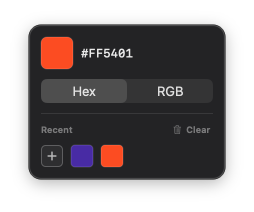

# Colores (v1.2.0)

A lightweight macOS menu bar color picker — a native replacement for [Couleurs](https://couleursapp.com/). Ships as a universal binary for Intel and Apple Silicon.



> Running an older version? Compare the number above to the one in **About Colores** (right-click the menu bar icon), then re-download `Colores.app` from this repo if you're behind.

**Menu bar:** click the eyedropper icon to open the picker; click it again to hide it. Once open, it stays floating on top of every other app (and every Space, including full-screen ones) until you close it yourself — nothing you click outside of it will dismiss it, so you can keep it parked on screen while you work and grab colors from it without switching away from your editor. Drag it anywhere by its background; it stays put the next time you reopen it.

**Dock icon:** since this is a menu-bar-only app (no Dock tile while running), dragging `Colores.app` onto the Dock yourself gives you a launcher shortcut rather than a live app tile. Clicking it opens the panel directly — on a cold launch and on every click after that, even while Colores is already running in the background.

**Popup:**
- Click the dashed **+** tile — the top preview before you've picked anything, or the first tile in the history strip afterward — to sample any pixel on screen with macOS's native loupe (`NSColorSampler`)
- Every pick copies to the clipboard automatically — a "✓ Copied" note flashes over the preview to confirm it
- Preview swatch + value; click either one (or ⌘C) to copy again in the current format
- Hex / RGB format toggle — copies automatically the instant you switch formats
- Recent-colors history: click a swatch to copy it again; hover a swatch and click the **×** in its corner to remove just that one, or **Clear** to wipe the whole strip (the strip stays hidden entirely until you've picked at least one color)

## How it works

Screen sampling uses `NSColorSampler`, Apple's own built-in eyedropper/loupe API (the same one behind Digital Color Meter and the system color panel) — available since macOS 10.15, which didn't exist yet when the original Couleurs shipped its own custom loupe. That's the whole reason this can be this small: no custom screen-capture or magnifier code needed.

The panel is a non-activating `NSPanel` at `.floating` window level, which is what lets it sit on top of whatever app you're using without ever stealing keyboard focus from it — clicking a swatch inside Colores doesn't switch you away from your editor. It's positioned under the menu bar icon only the first time it's shown after launch; after that it stays exactly where you last dragged it for as long as the app keeps running (quitting and reopening Colores resets it back under the icon).

## Requirements

- macOS 11 or later
- Intel or Apple Silicon Mac
- Xcode Command Line Tools (`xcode-select --install`) to build from source

## Download & run (no build required)

1. Download `Colores.app` from this repo
2. Move it to your `/Applications` folder
3. Right-click → **Open** → **Open** (required once to bypass Gatekeeper on unsigned apps)

## Build from source

```bash
git clone https://github.com/bereto-dev/colores.git
cd colores
make
open Colores.app
```

## First launch security

Because the app isn't signed or notarized (no Apple Developer account needed), macOS will block it the first time. Right-click → **Open** → **Open** to bypass Gatekeeper once.

## Settings

Right-click the menu bar icon → **Check for Updates…** / **About Colores** / **Quit Colores**. Inside the picker panel, the format toggle (Hex/RGB) is remembered between launches (`UserDefaults`), same as the recent-colors history.

## Icon

Using a placeholder icon for now — a proper one is coming later.

## Known limitation

The magnifier's zoom level when sampling is controlled entirely by macOS (`NSColorSampler` exposes no configuration at all — no magnification factor, no pixel size). It can't be made bigger without abandoning the native sampler and building a fully custom loupe from scratch, the way the original Couleurs did. Not planned unless that trade-off is worth it.

## Out of scope for v1

Deliberately left out of this rebuild, compared to the original Couleurs: a custom color-format template editor, `NSColor`/`UIColor`/`rgba()` copy formats, pasting (⌘V) to parse hex/rgb from the clipboard, a global system-wide keyboard shortcut, and Sparkle-style auto-updates (use **Check for Updates…** to jump to this repo instead). All straightforward to add later if needed.

## Changelog

### 1.2.0 — Intel and Apple Silicon
Colores now ships as a universal binary, so it opens on Intel Macs as well as Apple Silicon. v1.1.0 was Apple Silicon only and would not launch on Intel at all. The Hex/RGB toggle was also redrawn for the dark panel — selected format in `#515153`, unselected darker — so you can tell them apart and both labels stay readable. Requires macOS 11 or later.

### 1.1.0 — Always-on-top panel, Dock launcher, and bug fixes
- The panel now stays floating on top of every other app instead of dismissing when you click away
- Clicking a Dock icon you added yourself opens the panel, even if Colores is already running
- Fixed the picker getting stranded if a monitor was unplugged, or if you cleared the last recent color
- Dropped the RGBA copy format; Hex and RGB are the two options

### 1.0.0 — First release
A native Apple Silicon replacement for the discontinued Couleurs app: click the menu bar eyedropper, sample any pixel with macOS's own loupe, and copy Hex or RGB. Recent-colors history and a format toggle, with no custom magnifier code.

## Origin

Built by Roberto Pacheco to replace the discontinued Couleurs app after macOS flagged it for losing Intel-app compatibility.

## Support

If you find Colores useful, you can buy me a coffee ☕

[](https://buymeacoffee.com/bereto)

Built by [devteam.partners](https://devteam.partners/about-us) 🌐

---

Built with Swift + AppKit. Universal binary (x86_64 + arm64). No external dependencies.
